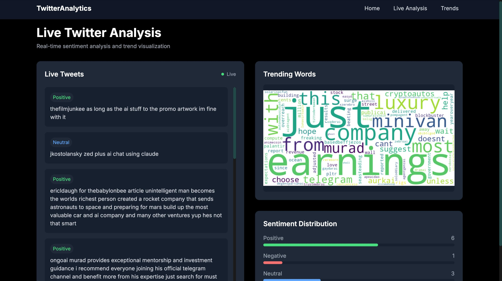
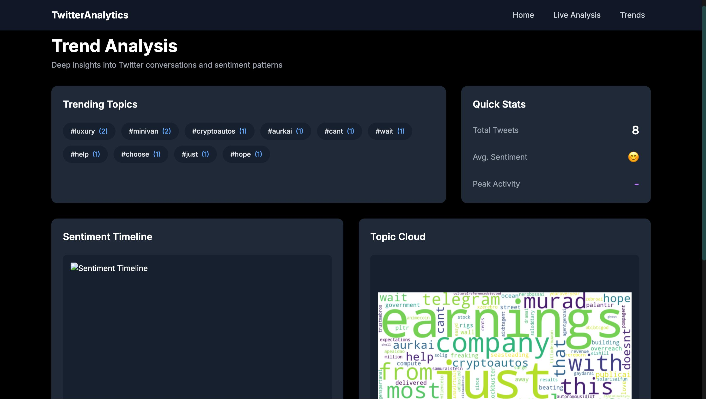
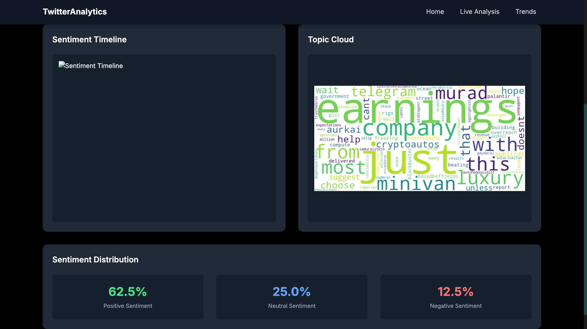

# Real-Time Social Media Analysis

A real-time social media analytics dashboard that processes Twitter data using Apache Flink, Kafka, and PostgreSQL, featuring sentiment analysis and trend visualization.





## Features

- Real-time tweet processing and sentiment analysis
- Interactive dashboard with dark theme
- Live word cloud visualization
- Sentiment distribution tracking
- Historical data persistence
- Trend analysis with timeline visualization

## Screenshots

### Live Analysis Dashboard


### Trend Analysis


### Historical Data View


## Technology Stack

- **Backend**: Python, Flask, SQLAlchemy
- **Frontend**: TailwindCSS, Socket.IO
- **Data Processing**: Apache Flink
- **Message Queue**: Apache Kafka
- **Database**: PostgreSQL
- **Containerization**: Docker

## Setup and Installation

1. Clone the repository:
```bash
git clone https://github.com/yourusername/RealTime-SocialMedia-Analysis.git
cd RealTime-SocialMedia-Analysis
```

2. Create and activate virtual environment

python -m venv venv
source venv/bin/activate  # For Unix/macOS

3. Install dependencies

pip install -r requirements.txt

4. Set up environment variables

cp .env.example .env
# Edit .env file with your Twitter API credentials

5. Start Kafka and run the producer and consumer

docker-compose up -d

# Terminal 1  
python kafka/consumer.py

# Terminal 2
python kafka/producer.py

## Current Features
- Real-time tweet collection using Twitter API v2
- Data streaming through Apache Kafka
- Basic tweet processing and storage
- Rate limit handling
- Configurable tweet limit
## Future Enhancements
- Real-time social media sentiment analysis
- Data visualization
- Advanced filtering options
- Database integration
- Real-time analytics dashboard
## License
MIT License

## Author
Mohammed Zubair A

## Acknowledgments
- Twitter API Documentation
- Apache Kafka Documentation
- Python Tweepy Library


