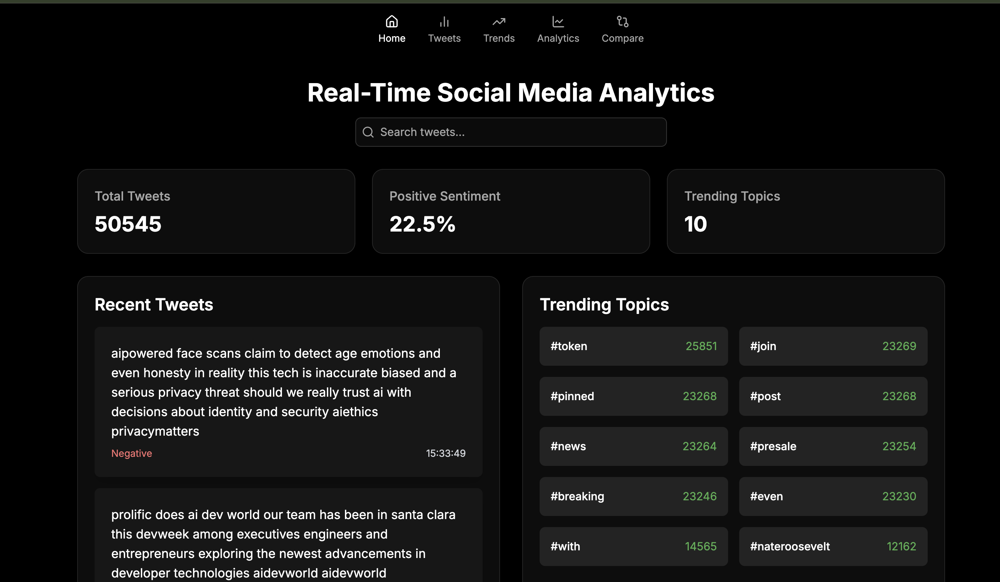
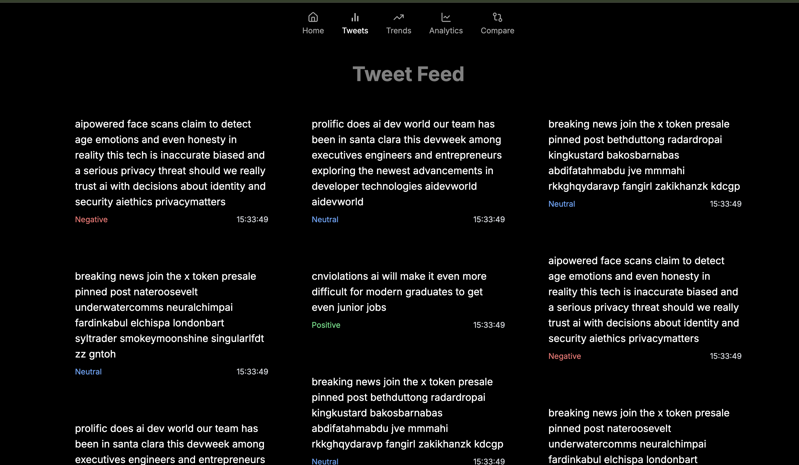
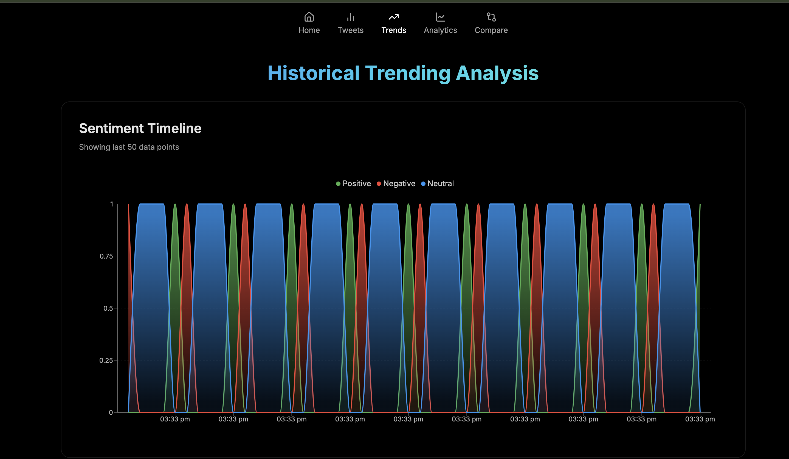
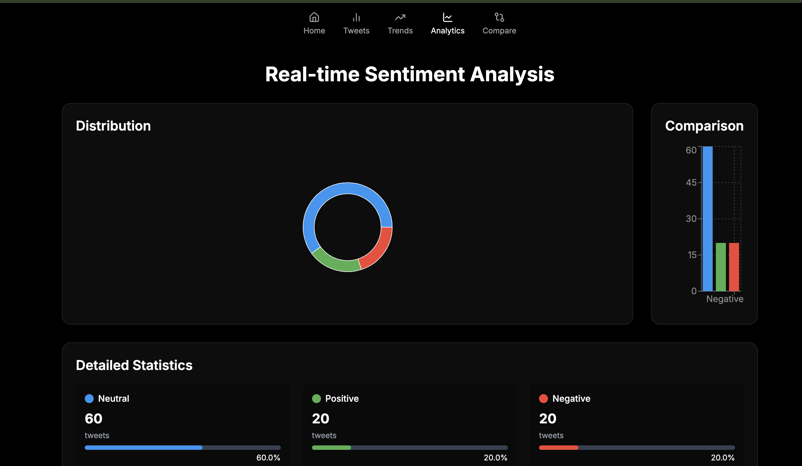
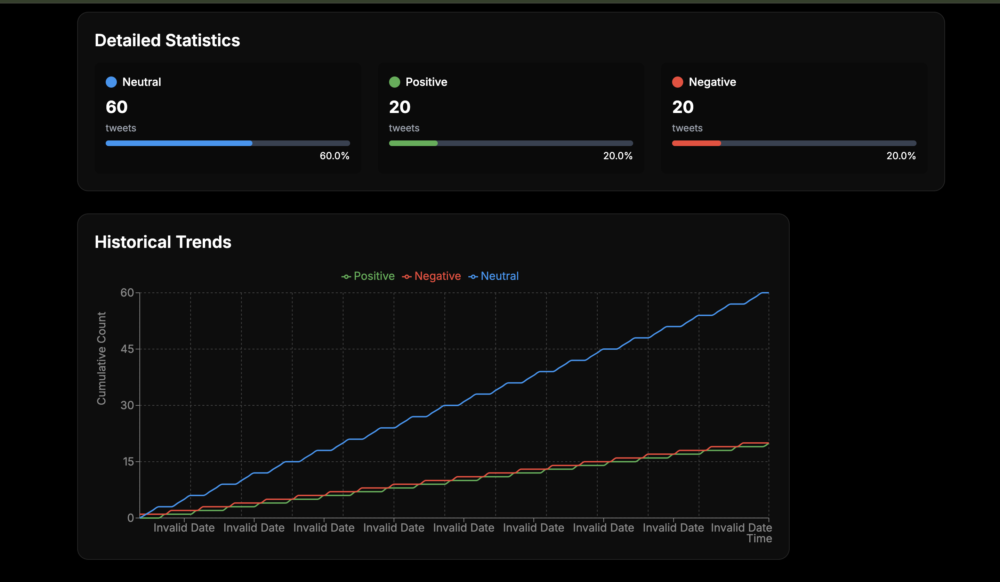
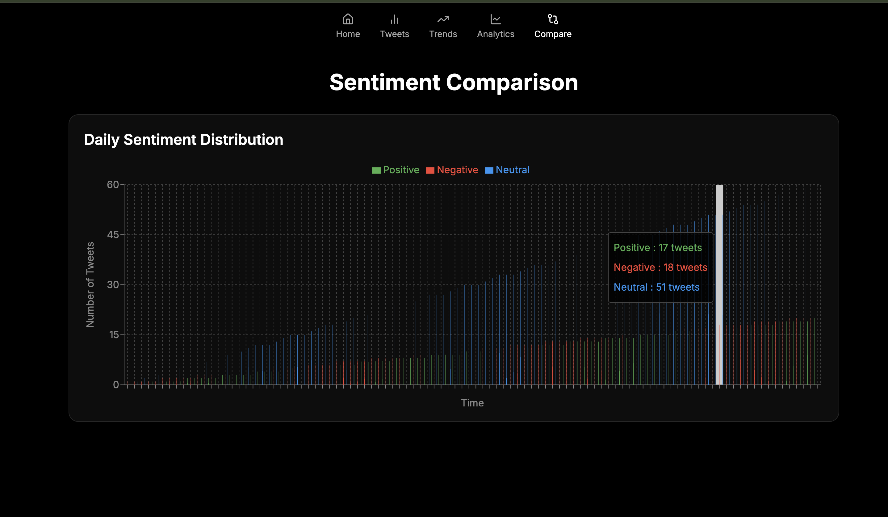

# Real-Time Social Media Analysis

RealTime Social Media Analytics is a web application that provides live and historical analysis of tweets. It uses a combination of Flask, Socket.IO, Kafka, and React to deliver real-time updates and insights.

# Demo








## Table of Contents

1. [Overview](#overview)
2. [Features](#features)
3. [Installation](#installation)
4. [Usage](#usage)
5. [Project Structure](#project-structure)
6. [Contributing](#contributing)
7. [License](#license)

## Overview

This project is designed to analyze tweets in real-time, providing insights into trending topics, sentiment analysis, and more. It leverages Kafka for message streaming, Flask for the backend, and React for the frontend.


## Features

- **Real-time Tweet Streaming**: View live tweets as they are processed.
- **Historical Data Analysis**: Access historical tweet data for deeper insights.
- **Sentiment Analysis**: Analyze the sentiment of tweets.
- **Responsive Design**: Optimized for both desktop and mobile devices.


## Installation

### Prerequisites

- Node.js and npm
- Python 3.x
- Docker and Docker Compose

### Setup

1. **Clone the repository:**

   ```bash
   git clone https://github.com/yourusername/RealTime-SocialMedia-Analytics.git
   cd RealTime-SocialMedia-Analytics


2. Backend Setup:
   
   - Navigate to the backend directory and set up the virtual environment:
     
     ```bash
     cd dashboard
     python -m venv venv
     source venv/bin/activate  # On Windows use `venv\Scripts\activate`
      ```
     ```
   - Install the required Python packages:
     
     ```bash
     pip install -r requirements.txt
      ```
   - Start the backend services using Docker Compose:
     
     ```bash
     docker-compose up -d
      ```
3. Frontend Setup:
   
   - Navigate to the frontend directory:
     
     ```bash
     cd ../frontend
      ```
   - Install the required npm packages:
     
     ```bash
     npm install
      ```
   - Start the React development server:
     
     ```bash
     npm start
      ```

## Usage
- Access the application at http://localhost:3000 .
- View live tweets and historical data.
- Analyze tweet sentiment and trends.

## Project Structure
```plaintext
```RealTime-SocialMedia-Analytics/
│
├── dashboard/
│   ├── app.py
│   ├── database.py
│   ├── requirements.txt
│   └── ...
│
├── frontend/
│   ├── app/
│   │   ├── components/
│   │   ├── hooks/
│   │   ├── tweets/
│   │   └── ...
│   ├── public/
│   ├── src/
│   ├── package.json
│   └── ...
│
└── assets/
    └── images/
        ├── img1.png
        ├── img2.png
        ├── img3.png
        ├── img4.png
        ├── img5.png
        └── img6.png

## Contributing
Contributions are welcome! Please fork the repository and submit a pull request for any improvements.

## Current Features
- Real-time tweet collection using Twitter API v2
- Data streaming through Apache Kafka
- Basic tweet processing and storage
- Rate limit handling
- Configurable tweet limit
## Future Enhancements
- Real-time social media sentiment analysis
- Data visualization
- Advanced filtering options
- Database integration
- Real-time analytics dashboard

## License
MIT License

This `README.md` provides a comprehensive overview of your project, including setup instructions, usage, and visual references. Adjust the content as needed to fit your specific project details and repository structure.


## Author
Mohammed Zubair A

## Acknowledgments
- Twitter API Documentation
- Apache Kafka Documentation
- Python Tweepy Library


