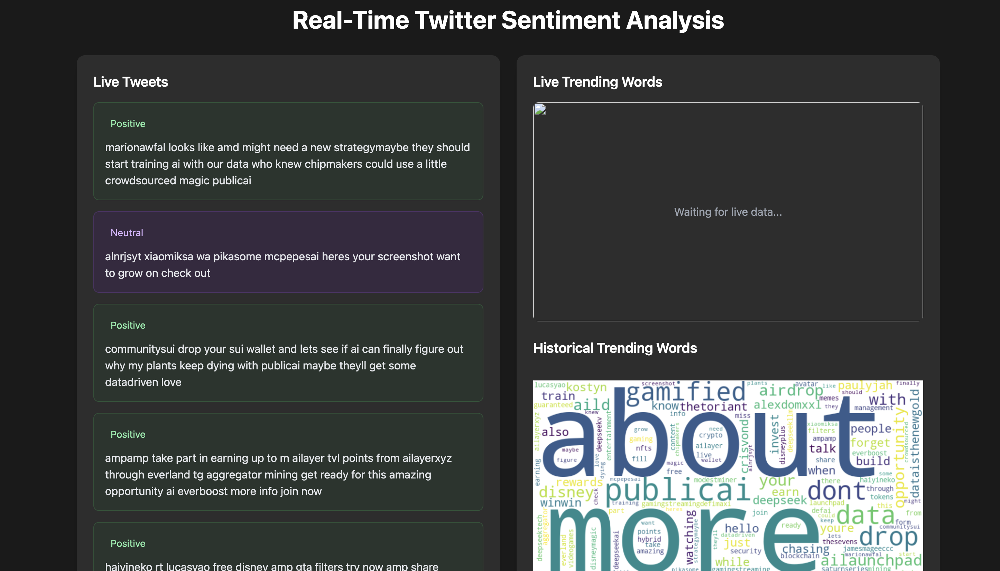

# Real-Time Social Media Analysis

A real-time data pipeline for collecting and analyzing social media data using Apache Kafka and Python.

## Project Overview

This project implements a real-time data pipeline that:
- Collects tweets about AI, Machine Learning, and Data Science
- Processes them through Apache Kafka
- Stores them for further analysis

## Technology Stack

- Python 3.9+
- Apache Kafka
- Docker & Docker Compose
- Twitter API v2
- Additional Python libraries:
  - tweepy
  - kafka-python
  - python-dotenv

## Project Structure
RealTime-SocialMedia-Analysis/
├── dashboard/
│   ├── app.py              # Flask application
│   ├── database.py         # Database models and operations
│   └── templates/          # Frontend templates
├── flink/
│   └── flink_processor.py  # Flink sentiment analysis
├── kafka/
│   └── producer.py         # Tweet producer
├── docker-compose.yml      # Docker services configuration
└── requirements.txt        # Python dependencies

## Contributing

1. Fork the repository
2. Create your feature branch ( git checkout -b feature/amazing-feature )
3. Commit your changes ( git commit -m 'Add some amazing feature' )
4. Push to the branch ( git push origin feature/amazing-feature )
5. Open a Pull Request

## Setup Instructions

1. Clone the repository

git clone <your-repository-url>
cd RealTime-SocialMedia-Analysis

2. Create and activate virtual environment

python -m venv venv
source venv/bin/activate  # For Unix/macOS

3. Install dependencies

pip install -r requirements.txt

4. Set up environment variables

cp .env.example .env
# Edit .env file with your Twitter API credentials

5. Start Kafka and run the producer and consumer

docker-compose up -d

# Terminal 1  
python kafka/consumer.py

# Terminal 2
python kafka/producer.py

## Current Features
- Real-time tweet collection using Twitter API v2
- Data streaming through Apache Kafka
- Basic tweet processing and storage
- Rate limit handling
- Configurable tweet limit
## Future Enhancements
- Real-time social media sentiment analysis
- Data visualization
- Advanced filtering options
- Database integration
- Real-time analytics dashboard
## License
MIT License

## Author
Mohammed Zubair A

## Acknowledgments
- Twitter API Documentation
- Apache Kafka Documentation
- Python Tweepy Library

